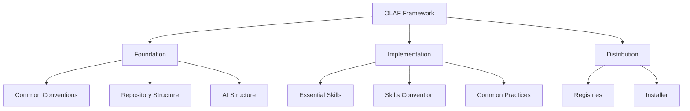

# Open Lightweight Assistant Framework (OLAF)

A collection of recommendations for enterprises, end users, and vendors of agentic solutions for software engineering.

The goal is to make agentic solutions easier to use, contribute to, develop, and deliver across a wide range of tools and vendors.

This work is based on the French GenAI "DO TANK."

## Rationale

- Most enterprises use multiple agentic solutions at the same time (IDE extensions, CLIs, and coded agents).
- Each vendor often promotes its own structure, naming conventions, and delivery approach. As a result, enterprises duplicate the same artifacts across tools.
- This duplication makes rollout, maintenance, and training costly, and it slows adoption.
- Enterprises want to avoid vendor lock-in while still benefiting from innovation across vendors, enterprises, and individual contributors.
- By sharing common conventions and structure, we aim to protect investment for everyone involved (enterprises, users, and vendors).

This proposal describes enterprise and user needs without enforcing a specific solution. It guides vendors and enterprises toward a shared structure and common conventions.

## Proposal

Agents use multiple artifacts to assist users in their tasks.
Enterprises need a defined structure to simplify artifact delivery.

## Quick Start

1. **Read the [History and Legitimacy](history-and-legitimacy.md)** to understand why OLAF exists
2. **Review [Common Conventions](common-coventions.md)** for basic naming and file rules
3. **Explore [Repository Structure](repo-olaf-structure.md)** to understand the organization
4. **Check [Essential Skills](essential-skills.md)** for core functionality requirements

## Structure

## Key components

### Foundation
- **Common Conventions** - File naming and general standards
- **Repository Structure** - Complete .olaf folder organization
- **AI Structure** - AI-specific artifact organization

### Implementation
- **Essential Skills** - Core skills for all OLAF implementations
- **Skills Convention** - Naming and structure guidelines
- **Common Practices** - Operational best practices

### Distribution
- **Registries** - Artifact management structure
- **Installer** - Installation requirements

## Contributing

This framework is based on work from the French GenAI 'DO TANK' and is openly shared to inspire other communities and vendors.

## License

This project is licensed under the MIT License - see the [LICENSE](../LICENSE) file for details.

---

**Current Status**: Draft proposal looking for feedback as of February 2026
